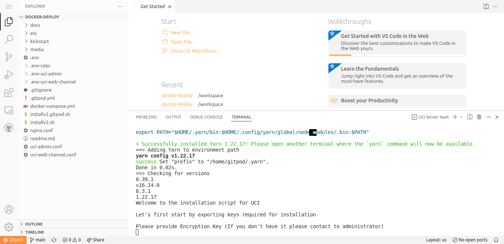
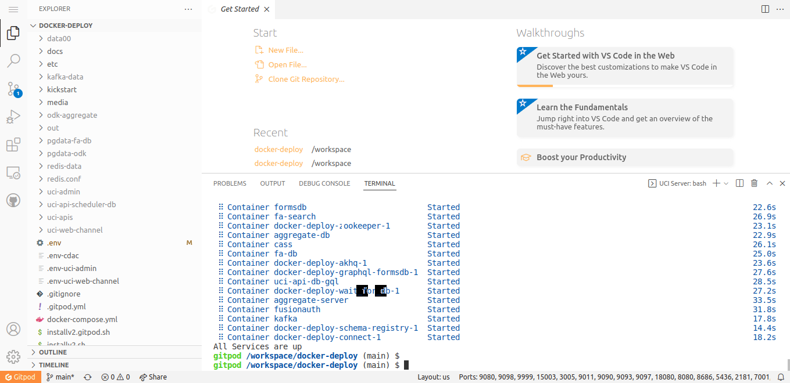
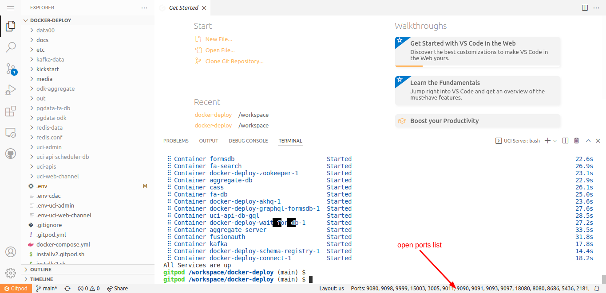
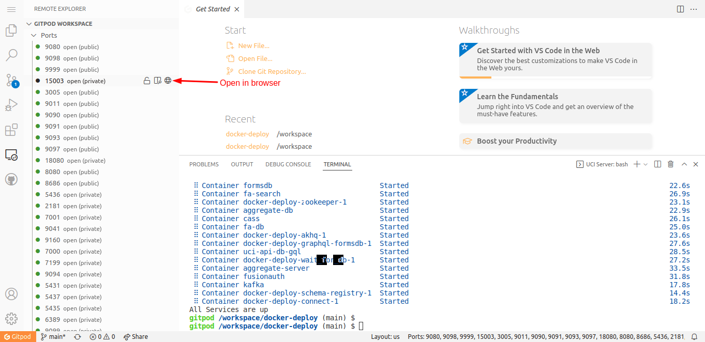
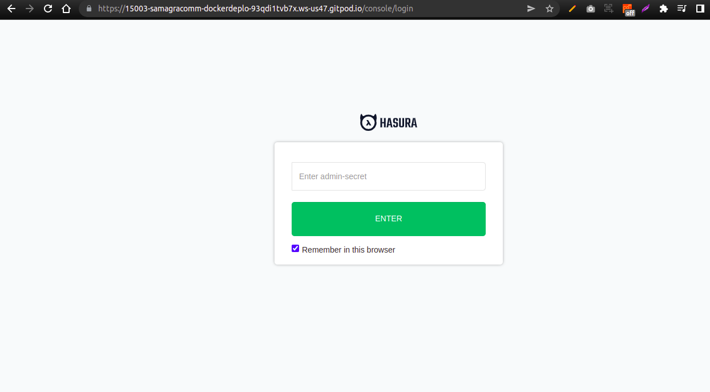
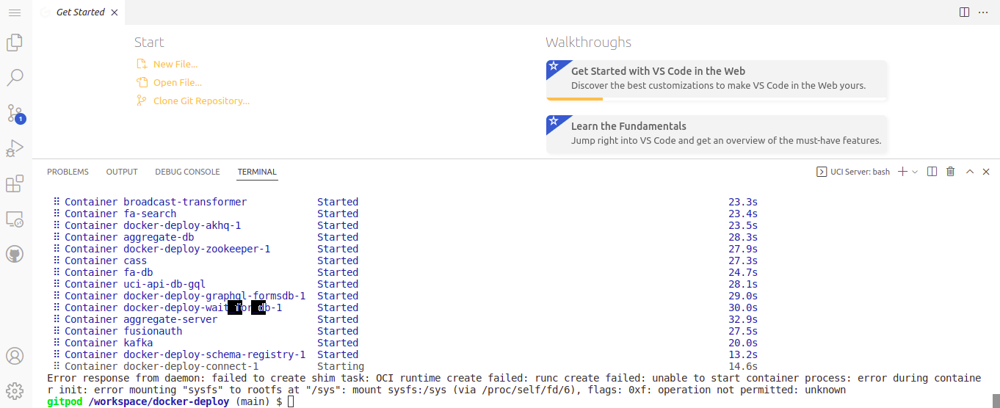

## Introduction
Docker-deploy as the name suggests is a docker-based deployment script that can be used to set up the UCI for usage.


### Why Docker?
We are using Docker to enable a smooth, single command experience for all the adopters of UCI to get it up and running. Docker is an open-source containerization platform. It enables developers to package applications into containers—standardized executable components combining application source code with the operating system (OS) libraries and dependencies required to run that code in any environment.

## Intended Users
Any user/ organization that wants to use setup UCI on their own server.

## Pre-requisites for Setting up UCI
1. Install Docker if not already installed. [Click Here](https://docs.docker.com/engine/install/ubuntu/)

2. Infra:
    * 8 CPU Cores
    * 16 GB RAM
    * 20 GB Storage
    * Server Fixed/Static IP
    * Preffered OS - Linux

3. Basic familiarity required with: 
    * Terminal & its commands
    * Docker
    * Server
    * Rest apis

4. Please make sure all of the ports mentioned used in the [file](docs/ports.md) are open & are not being used by any other service on server.


## Docker Setup Steps

### **Cloning and Run**

1. Take clone of this repository. 

    ``` git clone https://github.com/samagra-comms/docker-deploy.git ```

2. Go to folder
    
    ```cd docker-deploy```

3. Run below command to download & start the services using docker.

    ```bash install.sh```
    * If script is fail on runtime then you should run below commands for continue run this script
        * Stop the all services

            ```docker-compose down```

        * Start the all services

            ```docker-compose up -d```

4. While the script is running, You will be asked to enter encryption key, contact the [administrator](#contact-administrator) and get this.

5. If you are asked to enter Netcore Whatsapp Auth Token, Source, URI, enter the details if you have any else press enter. [Click here](#whatsapp-flow) to check the whatsapp configuration for netcore.


    **Note**: Please note this installation is just the first step. If your needs are not fulfilled with the current installation, please start scaling the individual services by using them in docker stack.

### **After a Successful Docker Setup Completion**
1. Script execution time - **Around 1 hours** (its depends on your server)
2. On a successful run of the script you will get below services:
    * Inbound Service: http://localhost:9080/health
    * Orchestrator Service: http://localhost:8686/health
    * Transformer Service: http://localhost:9091/health
    * Outbound Service: http://localhost:9090/health
    * Broadcast Transformer Service: http://localhost:9093/health
    * Campaign Service: http://localhost:9999
    * Kafka UI: http://localhost:18080/ui/docker-kafka-server/topic
    * Bot DB Hasura UI: http://localhost:15003/console/login
    * Fusion Auth: http://localhost:9011
    * ODK: http://localhost:8080/Aggregate.html#management/forms
    * Chat Frontend: http://localhost:9098
    * Admin Console: http://localhost:9097

    **Note**: If above mentioned url's are not working then restart the all docker services or check the docker container logs.

3. If you want to check logs for a specific service, follow below flow.
    * Show all docker containers
        
        ```docker ps -a```
    
    * Copy the container id from the list for the service you want to see the logs for, and use it in below command.
        
        ```docker --follow --tail 10 container_id```

**Note**: If the services are updated on any server, use server's ip instead of localhost. Eg. http://143.112.x.x:9080

### **Steps After Docker Setup**

1. **Tracking Tables/Views :** When the script is executed, tables will be created for bot schema via migrations. These tables can be assessed in Hasura. We need to track these tables to expose these tables to Hasura GraphQL. [Click to view](https://hasura.io/docs/latest/graphql/core/databases/postgres/schema/using-existing-database/) tracking overview.
    
    * Go to the url http://localhost:15003/console/data/default/schema/public
    * The admin secret can be controlled using this [link](https://github.com/samagra-comms/docker-deploy/blob/10bdbc4b837a61f74a1270ce53467b15f63d182d/.env#L67)


2. After the tables are created, some default data for adapter, transformers etc should be added. These will be used later while creating a bot. Please follow below step:
    - Go to http://localhost:15003/console/data/default/schema/public and track all of the items one by one.
    - In the sidebar click on the SQL button and add the following commands and run.
        ```sql
        INSERT INTO service ("id", "type", "config")
        VALUES ('94b7c56a-6537-49e3-88e5-4ea548b2f075', 'odk', '{"cadence": { "retries": 0, "timeout": 60, "concurrent": true, "retries-interval": 10 }, "credentials": { "vault": "samagra", "variable": "samagraMainODK" } }');
        INSERT INTO adapter ("id", "provider", "channel", "config", "name") 
        VALUES ('44a9df72-3d7a-4ece-94c5-98cf26307324', 'WhatsApp', 'gupshup', '{ "2WAY": "2000193033", "phone": "9876543210", "HSM_ID": "2000193031", "credentials": { "vault": "samagra", "variable": "gupshupSamagraProd" } }', 'SamagraProd');
        INSERT INTO adapter ("id", "provider", "channel", "config", "name") 
        VALUES ('44a9df72-3d7a-4ece-94c5-98cf26307323', 'WhatsApp', 'Netcore', '{ "phone": "912249757677", "credentials": { "vault": "samagra", "variable": "netcoreUAT" } }', 'SamagraNetcoreUAT');
        INSERT INTO transformer ("name", "tags", "config", "id", "service_id") 
        VALUES ('SamagraODKAgg', array['ODK'], '{}', 'bbf56981-b8c9-40e9-8067-468c2c753659', '94b7c56a-6537-49e3-88e5-4ea548b2f075'); 
        ```

3. Now we can start Sent/Receive messages using uci web channel http://localhost:9098/ but first you should [create a bot](#setting-up-your-first-bot) for conversation after that you will send starting message.

4. You can start using FusionAuth Console using http://localhost:9011/ and create an Account, for managing users and what resources they are authorized to access.

5. For managing all the assesment data go on URL : http://localhost:15002/ and track all the tables and relation using [token](https://github.com/samagra-comms/docker-deploy/blob/main/docker-compose.yml#L363).

## Gitpod Setup Steps
<!-- * If you are just here to try the setup please click on the button below. -->
### **Introduction**
Gitpod continuously builds your git branches like a CI server so that you can start coding right away - no more waiting for dependencies to download and builds to finish.

**Gitpod = server-side-dev-envs + dev-env-as-code + prebuilds + IDE + collaboration.**

### **How to Run Script on Gitpod**

1. Click below button for gitpod workspace

    [](https://gitpod.io/#https://github.com/samagra-comms/docker-deploy/installv2.gitprod.sh)

2. After click above button we will show below screen

    

3. While the script is running, You will be asked to enter encryption key, contact the [administrator](#contact-administrator) and get this.

4. If you are asked to enter Netcore Whatsapp Auth Token, Source, URI, enter the details if you have any else press enter. [Click here](#whatsapp-flow) to check the whatsapp configuration for netcore.

5. After configuration, it will take time for cloning and container creation **Around 45 Minutes**

6. If you see below screen it means your all services are up

    

    **Note**: This script may fail during runtime, in this case run the below commands to restart services.
    * Stop the all services

        ```docker-compose down```

    * Start the all services

        ```docker-compose up -d```

7. How to get list of open ports

    

8. How to get gitpod url for individual service
    * List of running services port. Click the browser icon

        

    * After click, It will open in new tab 
        

        **Gitpod Sample URL** : https://15003-samagracomm-dockerdeplo-93qdi1tvb7x.ws-us47.gitpod.io/console/login


### **After Setup Completion**
1. On a successful run of the script you will get below services:
    * Inbound Service: https://9080-gitpodurl/health
    * Orchestrator Service: https://8686-gitpodurl/health
    * Transformer Service: https://9091-gitpodurl/health
    * Outbound Service: https://9090-gitpodurl/health
    * Broadcast Transformer Service: https://9093-gitpodurl/health
    * Campaign Service: https://9999-gitpodurl
    * Kafka UI: https://18080-gitpodurl/ui/docker-kafka-server/topic
    * Bot DB Hasura UI: https://15003-gitpodurl/console/login
    * Fusion Auth: https://9011-gitpodurl
    * ODK: http://8080-gitpodurl/Aggregate.html#management/forms
    * Chat Frontend: https://9098-gitpodurl
    * Admin Console: https://9097-gitpodurl

2. If you want to check logs for a specific service, follow below flow.
    * Show all docker containers
        
        ```docker ps -a```
    
    * Copy the container id from the list for the service you want to see the logs for, and use it in below command.
        
        ```docker --follow --tail 10 container_id```


### **Steps After All Services Running**

*  When all services are up, we will have to follow the same routine we do in docker setup after steps. [Click here](#steps-after-docker-setup) to view the steps.\
**Note**: we will have to change the url in the steps to that of gitpod ones.


## Common Errors and resolution
1. On Sending the starting message to [UCI front](http://localhost:9098/) , if you do not receive any reply in 1 minute. Follow below steps
    * Check the logs of inbound service using below command
        * Check the container id

            ```docker ps -a```
        * Check the logs for orchestrator container

            ```docker logs --follow --tail 100 container_id```
        * If log shows pushed to inbound-processed topic, then follow the same flow for orchestrator, transformer or outbound 
    *  One of the service must not be receiving data from topic, restart that service using below commands
        * Check the container id

            ```docker ps -a```
        * Stop the service

            ```docker stop container_id```

        * Start the service

            ```docker-compose up -d service_name```

2. When we run script on gitpod sometimes we are facing below error 

    

    * Stop the all services

         ```docker-compose down```

    * Start the all services

        ```docker-compose up -d```


## Setting up your first bot
1. UCI Admin
    1. Go to [Link](http://localhost:9097/uci-admin)
    2. Click on Add new button
    3. Fill the form with a unique starting message, start date equals to current & end date more than current date.
    4. Click on next button 
    5. Click on Add logic button
    6. Fill the form & upload a xml form. Eg. [Sample ODK Excel Form](media/List-QRB-Test-Bot.xml)
    7. Add this & submit this form.
    8. The bot will be added and we can start using this on [UCI front](http://localhost:9098).
2. APIs
    1. Convert a ODK Excel form to XML form using [Link](https://getodk.org/xlsform/).

        [Sample ODK Excel Form](media/List-QRB-Test-Bot.xlsx)

    2. Upload this XML from using this api.
        ```
        curl --location --request POST 'http://localhost:9999/admin/v1/forms/upload' \
        --header 'admin-token: EXnYOvDx4KFqcQkdXqI38MHgFvnJcxMS' \
        --form 'form=@"{PATH_OF_ODK_FORM}"'
        ```

        [Sample ODK XML Form](List-QRB-Test-Bot.xml)

        **Response**: The api will return a form id, use this form id in create conversation logic api. Form id Eg. **List-Button-test-v1**

        ```
        {
            "ts": "2022-05-24T13:46:06.640Z",
            "params": {
                "resmsgid": "dc586de0-db67-11ec-ae84-fbd67a9c1174",
                "msgid": null,
                "status": "successful",
                "err": null,
                "errmsg": null
            },
            "responseCode": "OK",
            "result": {
                "data": "List-Button-test-v1"
            }
        }    
        ```

    3. Create a Conversation Logic

        ```
        curl --location --request POST 'http://localhost:9999/admin/v1/conversationLogic/create' \
        --header 'admin-token: EXnYOvDx4KFqcQkdXqI38MHgFvnJcxMS' \
        --header 'Content-Type: application/json' \
        --data-raw '{
            "data": {
                "name": "UCI demo bot logic",
                "transformers": [
                    {
                        "id": "bbf56981-b8c9-40e9-8067-468c2c753659",
                        "meta": {
                            "form": "https://hosted.my.form.here.com",
                            "formID": "List-Button-test-v1"
                        }
                    }
                ],
                "adapter": "44a9df72-3d7a-4ece-94c5-98cf26307323"
            }
        }'
        ```

        **Response**: It will return a conversation logic id, use it in create bot api. Eg. **92f7b965-4118-4ddc-9c7d-0bc0f77092db**

        ```
        {
            "ts": "2022-05-24T13:48:06.407Z",
            "params": {
                "resmsgid": "23b94970-db68-11ec-ae84-fbd67a9c1174",
                "msgid": null,
                "status": "successful",
                "err": null,
                "errmsg": null
            },
            "responseCode": "OK",
            "result": {
                "data": {
                    "transformers": "[{"id":"bbf56981-b8c9-40e9-8067-468c2c753659","meta":{"form":"https://hosted.my.form.here.com/%22,/%22formID/%22:/%22List-Button-test-v1/%22%7D%7D]",
                    "adapter": "44a9df72-3d7a-4ece-94c5-98cf26307323",
                    "name": "UCI demo bot logic",
                    "id": "92f7b965-4118-4ddc-9c7d-0bc0f77092db"
                }
            }
        }
        ```

    4. Create a bot

        ```
        curl --location --request POST 'http://localhost:9999/admin/v1/bot/create' \
        --header 'admin-token: EXnYOvDx4KFqcQkdXqI38MHgFvnJcxMS' \
        --header 'Content-Type: application/json' \
        --data-raw '{
            "data": {
                "startingMessage": "Hi Test Bot",
                "name": "Test Bot",
                "users": [],
                "logic": [
                    "c556dfc8-5dd3-477c-83bb-65d234c4d223" // Get this id from Create a conversation logic api.
                ],
                "status": "enabled",
                "startDate": "2022-05-24",
                "endDate": "2023-05-24"
            }
        }'
        ```

        **Response**: This api will return a bot id & other bot information. Use the starting message (Eg. **Hi Test Bot**) from here to start conversation with a bot.

        ```
        {
            "ts": "2022-05-24T13:49:15.292Z",
            "params": {
                "resmsgid": "4cc874d0-db68-11ec-ae84-fbd67a9c1174",
                "msgid": null,
                "status": "successful",
                "err": null,
                "errmsg": null
            },
            "responseCode": "OK",
            "result": {
                "data": {
                    "startingMessage": "Hi Test Bot",
                    "name": "Test Bot",
                    "users": [],
                    "status": "enabled",
                    "startDate": "2022-05-24",
                    "endDate": "2023-05-24",
                    "logicIDs": [
                        "92f7b965-4118-4ddc-9c7d-0bc0f77092db"
                    ],
                    "id": "9f0b1401-44d2-46be-83bd-7cbd5014f899"
                }
            }
        }
        ```

    **Note**: If you want to use the gupshup adapter, please contact the [administrator](#contact-administrator) for credentials.

## Start using bot
### Using Web Channel
Once the bot is created, we can start using it. Send the starting message added in the **Create a bot** api.

**Example :** Hi Test Bot


### Using Whatsapp
Once the bot is created, we can start using it. If you have set up gupshup/netcore provider for whatsapp, Send the starting message added in the **Create a bot** api to the whatsapp number.


## Whatsapp Flow
1. To get the messages from any service provider say netcore/gupshup, contact their support team, and ask them to add your ip with netcore/gupshup adapter url
For Netcore: ip:inbound_extrenal_port/netcore/whatsApp (Eg. - 143.112.x.x:9080/netcore/whatsApp)
For Gupshup: ip:inbound_external_port/gupshup/whatsApp (Eg. - 143.112.x.x:9080/gupshup/whatsApp)

2. To sent messages via outbound, we'll use API from service provider (Netcore/Gupshup). For Netcore, Contact their support team to grant below credentials :
    ```
        NETCORE_WHATSAPP_AUTH_TOKEN = # Authentication Token 

        NETCORE_WHATSAPP_SOURCE = # Source ID for sending messages to Netcore 

        NETCORE_WHATSAPP_URI = # Netcore API Base URL
    ```

    Update these details in [.env](.env) file and restart inbound & outbound services to reflect the changes.

## Contact Administrator:
Please write to the Maintainer - **Chakshu (chakshu@samagragovernance.in)**, and cc - **Saket (saket@samagragovernance.in)**, **Sukhpreet (sukhpreet@samagragovernance.in)**

### TODO
1. DB for UCI APIs doesn't get auto populated for the default ODK transformers.
2. [Auto Tracking of tables not supported](https://github.com/hasura/graphql-engine/issues/1418) - this can be automated by writing a script to do POST requests like mentioned [here](https://hasura.io/docs/latest/graphql/core/api-reference/schema-metadata-api/table-view.html).
3. Adding docker stack commands to scale up.
4. Add benchmarking.
5. Add CI to verify setup.

## FYI
1. If asked **Would you like to share anonymous usage data about this project with the Angular Team at Google under Google’s Privacy Policy at https://policies.google.com/privacy? For more details and how to change this setting, see http://angular.io/analytics.**, Press **y**.

2. If you change anything in [.env](.env) file, you will have to stop the services, then restart them.
    * Stop all services:
    
        ```docker-compose -f docker-compose.yml down```

    * Start all services:
    
        ```docker-compose -f docker-compose.yml up -d```